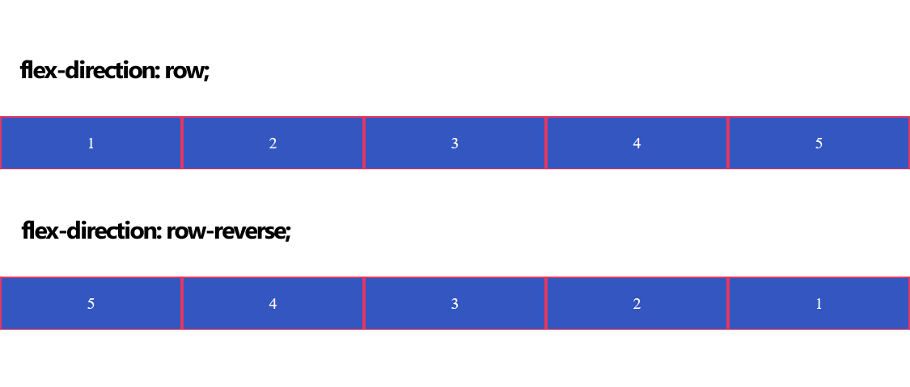
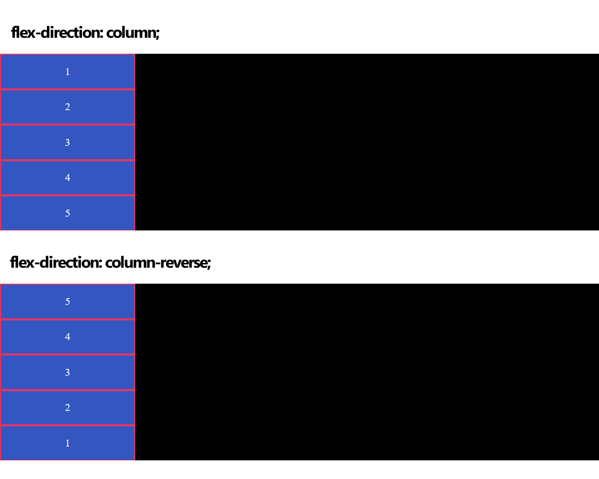
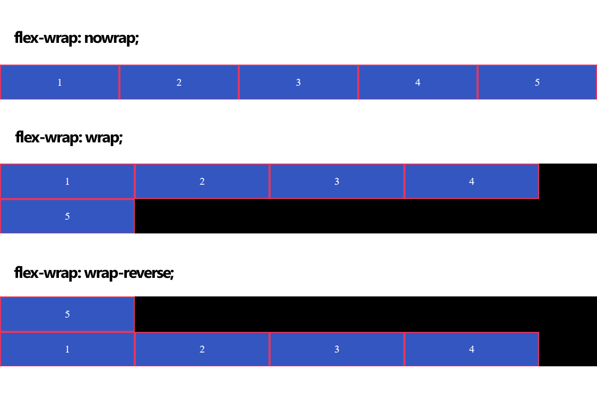
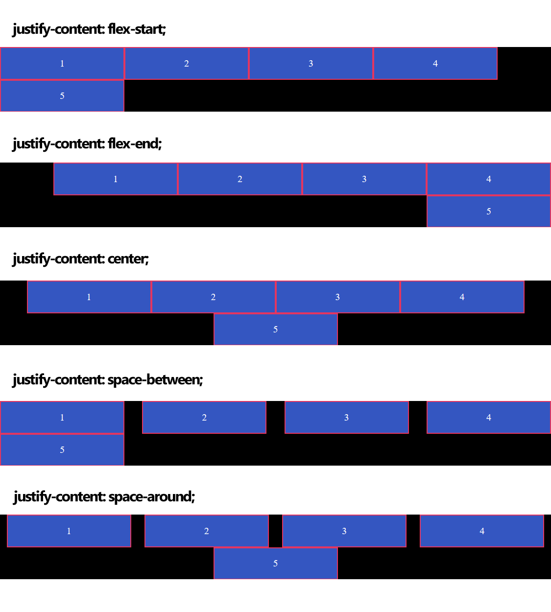
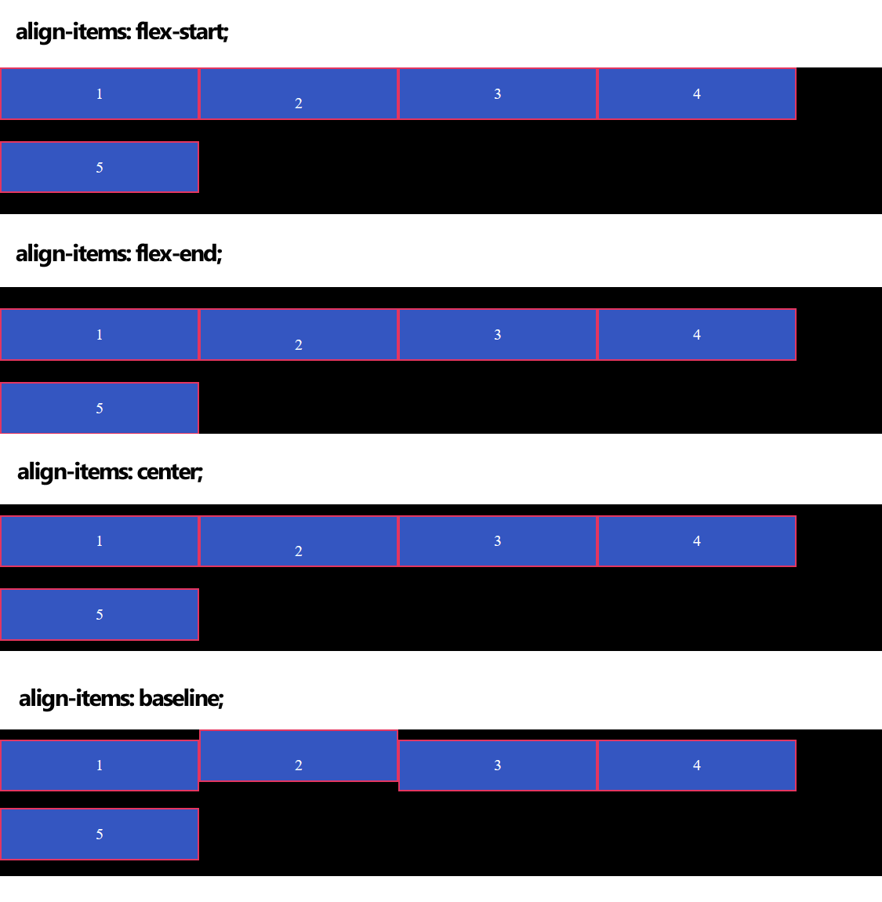
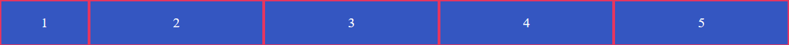
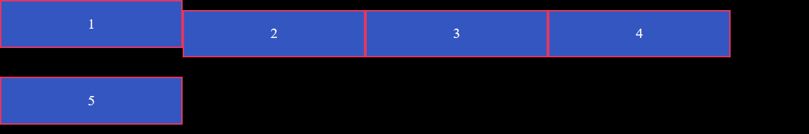

## Flex布局总结 ##

### 目录 ###

1. 参考链接
2. 什么是Flex布局
3. 容器
4. 定义容器
5. 构建测试页面
6. 容器的属性
    1. flex-direction属性
    2. flex-wrap属性
    3. flex-flow属性
    4. justify-content属性
    5. align-items属性
    6. align-content属性
7. 项目的属性
    1. order属性
    2. flex-grow属性
    3. flex-shrink属性
    4. flex-basis属性
    5. flex 属性
    6. align-self属性

---

### 参考链接 ###

- [Flex布局语法教程](http://www.tuicool.com/articles/vIJFfa)

---

### 什么是Flex布局 ###

2009年，W3C提出了一种新的布局方案——Flex，Flex 可以简便、完整、响应式地实现各种页面布局。目前，它已经得到了所有浏览器的支持，可以安全地使用这项功能。 

Flex(Flexible Box)，意为“弹性布局”，用来为盒状模型提供最大的灵活度。

---

### 容器 ###

采用 Flex 布局的元素，称为 Flex 容器(Flex Container)，它的所有子元素自动成为容器成员，称为 Flex 项目(Flex Item)。

容器默认存在两根轴：水平轴和垂直轴，项目默认沿主轴排列。

---

### 定义容器 ###

无论是块级元素还是行内元素都可以定义为容器：

```
.block{
    display: flex;/* 块级Flex */
}
.inline{
    display: inline-flex;/* 行内Flex */
}
```

对于 Webkit 内核的浏览器，必须加上`-webkit`前缀：

```
.box{
    display: -webkit-flex;
    display: flex;
}
```

设置为容器后，子元素的`float`、`clear`和`vertical-align`等属性将失效。

---

### 构建测试页面 ###

构建测试页面 index.html：

```
<!DOCTYPE html>
<html>
<head>
    <meta charset="UTF-8" />
    <link rel="stylesheet" type="text/css" href="style.css" />
</head>
<body>
    <ul>
        <li> 1 </li>
        <li> 2 </li>
        <li> 3 </li>
        <li> 4 </li>
        <li> 5 </li>
    </ul>
</body>
</html>
```

CSS 样式文件 style.css：

```
ul{
    width: 900px;
    padding: 0;
    margin: 0;
    display: flex;
    display: -webkit-flex;
    list-style-type: none;
    background-color: #000;
}
ul li{
    width: 200px;
    height: 50px;
    line-height: 50px;
    background-color: #3456c1;
    text-align: center;
    color: white;
    border: 2px solid #e43660;
}
```

查看效果为：


---

### 容器的属性 ###

容器元素可以设置6个 CSS 属性：
- flex-direction
- flex-wrap
- flex-flow
- justify-content
- align-items
- align-content

#### flex-direction属性 ####

flex-direction 属性决定项目的排列方向，其取值有：
1. row：默认值，水平方向，起点在左端；
2. row-reverse：水平方向，起点在右边；
3. column：垂直方向，起点在上沿；
4. column-reverse：垂直方向，起点在下沿。

flex-direction 分别设为 row 和 row-reverse 的查看效果为：



flex-direction 分别设为 column 和 column-reverse 的查看效果为：



#### flex-wrap属性 ####

默认情况下，项目都排在一条线上，flex-wrap 属性定义了如果一条线排不下时如何换行形成一根新的轴线，其取值有：
1. nowrap：默认值，表示不换行；
2. wrap：换行，第一行在上；
3. wrap-reverse：换行，第一行在下。

查看效果为：



#### flex-flow属性 ####

flex-flow 属性是 flex-direction 属性 和 flex-wrap 属性的组合，默认值为`row nowrap`。

#### justify-content属性 ####

justify-content 属性定义了项目在水平轴上的对齐方式，其取值有：
1. flex-start：默认值，表示左对齐；
2. flex-end：右对齐；
3. center：居中对齐；
4. space-between：两端对齐，项目之间的间隔都相等；
5. space-around：每个项目两端的间距相等，所以项目之间的间距比项目与边框的间距大一倍。

先将 flex-wrap 设置为 `wrap`，接着为 justify-content 属性设置不同的值，查看效果为：



#### align-items属性 ####

align-items 属性定义了项目在垂直轴上如何对齐，其取值有：
1. flex-start：垂直轴上起点对齐；
2. flex-end：垂直轴上终点对齐；
3. center：垂直轴上中点对齐；
4. baseline：项目的第一行文字的基线对齐；
5. stretch：默认值，如果项目未设置高度或设置为 auto，将占满整个容器的高度。

同样将 flex-wrap 设置为 `wrap`，然后将第二个 li 标签修改为`<li style="line-height:70px;"> 2 </li>`，并将 ul 标签的 height 设置为150px，接着为 align-items 属性设置不同的值，查看效果为：



#### align-content属性 ####

align-content 属性定义了多根轴线(项目发生换行)的对齐方式，如果项目只有一根轴线，该属性不起作用，其取值与 align-items 属性的取值相同。

---

### 项目的属性 ###

项目同样可以设置6个 CSS 属性：
- order
- flex-grow
- flex-shrink
- flex-basis
- flex
- align-self

#### order属性 ####

order 属性定义项目的排列顺序，其取值为一个整数，数值越小，该项目就越靠前，默认值为0。

将 ul 标签的内容修改为：
```
<ul>
    <li style="order:4"> 1 </li>
    <li style="order:5;"> 2 </li>
    <li style="order:2;"> 3 </li>
    <li style="order:3;"> 4 </li>
    <li style="order:1;"> 5 </li>
</ul>
```

查看效果为：


#### flex-grow属性 ####

flex-grow 属性定义项目的放大比例，默认值为0，表示不放大。

将 li 标签的 width 设置为0，然后将 ul 标签的内容修改为：
```
<ul>
    <li style="flex-grow:1;"> 1 </li>
    <li style="flex-grow:2;"> 2 </li>
    <li style="flex-grow:1;"> 3 </li>
    <li style="flex-grow:1;"> 4 </li>
    <li style="flex-grow:1;"> 5 </li>
</ul>
```

查看效果为：


#### flex-shrink属性 ####

flex-shrink 属性定义了项目的缩小比例，不能取负值，默认值为1，取值为0表示不缩小。

如果所有项目的 flex-shrink 属性都设为1，当空间不足时，都将等比例缩小，如果一个项目的 flex-shrink 属性为0，其他项目都为1，则空间不足时，前者不缩小。

将 ul 标签的 width 改为 500，然后将 ul 标签的内容修改为：
```
<ul>
    <li style="flex-shrink:0;"> 1 </li>
    <li style="flex-shrink:1;"> 2 </li>
    <li style="flex-shrink:1;"> 3 </li>
    <li style="flex-shrink:1;"> 4 </li>
    <li style="flex-shrink:1;"> 5 </li>
</ul>
```

查看效果为：


#### flex-basis属性 ####

flex-basis 属性定义了在分配多余空间之前，项目占据的水平轴空间，浏览器根据这个属性，计算水平轴是否有多余空间，默认值为   `auto`，即项目的本来大小。

修改第一个 li 标签为`<li style="flex-basis:100px;"> 1 </li>`，查看效果为：



#### flex属性 ####

flex 属性是 flex-grow、flex-shrink 和 flex-basis 属性的组合，默认值为`0 1 auto`，后两个属性可选。

flex 属性可以使用两个快捷值：`auto`和`none`，`auto`相当于`1 1 auto`，`none `相当于`0 0 auto`。

#### align-self属性 ####

align-self 属性允许单个项目有与其他项目不一样的对齐方式，可覆盖 align-items 属性。默认值为`auto`，表示继承父元素的 align-items 属性，如果没有父元素，则等同于`stretch`。

该属性可取6个值，除了`auto`，其他值皆与 align-items 相同。

修改 ul 标签的 height 为150px，并将 flex-wrap 属性设为 `wrap`，将 align-items 属性设为 `center`，修改第一个 li 标签为`<li style="align-self:flex-start;"> 1 </li>`，查看效果为：



---

```
ARTICLE_ID      : 1
POST_DATE       : 2017/08/14
RECENTLY_MODIFY : 2017/08/14
TIME_COUNTER    : 0D
AUTHER          : WJT20
```