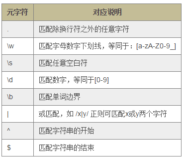
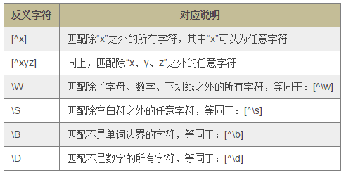
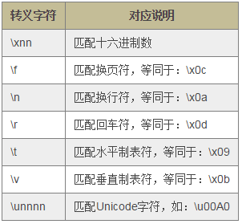
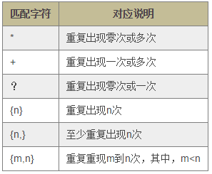
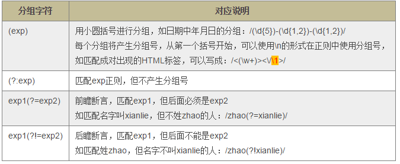
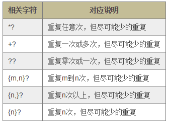
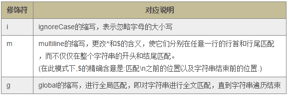

# JavaScript正则知识点总结 #

## 目录 ##

1. 字符
2. RegExp类型

---

## 字符 ##

1. 元字符  

    

2. 反义字符  

    

3. 转义字符  

    

4. 重复匹配  

    

5. 分组/捕获  

    

6. 贪婪与惰性  

    

7. 修饰符  

    

---

## RegExp 类型 ##

定义正则表达式有两种方式：

1. 字面量形式：`var pattern = /.\w/gi；`
2. RegExp 构造函数形式：`var pattern = new RegExp('.\\w', 'gi');`

正则对象(使用 RegExp 构造函数创建)方法有：

1. pattern.test(string)：对传入的 string 字符串进行模式匹配，返回一个布尔值，表示字符串是否匹配该正则。
2. pattern.exec(string)：返回一个匹配项数组。

字符串对象的 match()、search()、split() 及 replace() 等方法也与正则表达式相关。

---

```
ARTICLE_ID : 17
POST_DATE : 2017/08/19
RECENTLY_MODIFY : 2017/08/31
TIME_COUNTER : 1
AUTHER : WJT20
```
