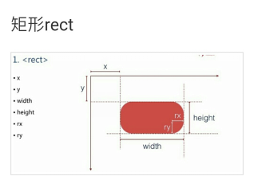
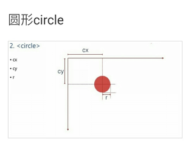
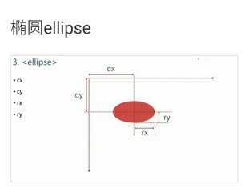
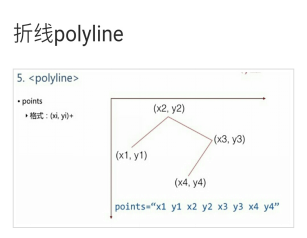
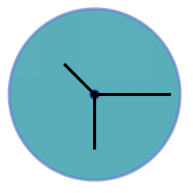

## SVG和Canvas ##

### 目录 ###

1. SVG
	1. 预定义形状元素
	2. 绘制时钟
2. Canvas
	1. 创建一个画布
	2. 绘图准备
	3. 填充和描边
	4. 绘制矩形
	5. 绘制路径
	6. 绘制文本
	7. 变换
	8. 绘制图像
	9. 阴影
	10. 渐变
3. Canvas与SVG的区别

---

### SVG ###

SVG指可伸缩矢量图形(Scalable Vector Graphics)，可用来定义用于网络的基于矢量的图形。SVG 使用 XML 格式定义图形，在放大或改变尺寸的情况下其图形质量不会有所损失，SVG在IE9以及 Firefox 和 chrome 下都支持。  

#### 预定义形状元素 ####







#### 绘制时钟 ####

svg文件代码：

```
<svg xmlns="http://www.w3.org/2000/svg" version="1.0">
  <circle cx="300" cy="300" r="280" fill="#2795a5" opacity="0.5" />
  <circle cx="300" cy="300" r="280" fill="#2795a5" opacity="0.5" stroke="#3456c1" stroke-width="5" />
  <circle cx="300" cy="300" r="15" fill="black" stroke="#3456c1" stroke-width="5" />
  <line x1="300" y1="300" x2="550" y2="300" stroke="black" stroke-width="10" />
  <line x1="300" y1="300" x2="300" y2="480" stroke="black" stroke-width="10" />
  <line x1="300" y1="300" x2="200" y2="200" stroke="black" stroke-width="10" />
</svg>
```

效果图：  



---

### Canvas ###

IE9之前的浏览器都不支持canvas元素。

#### 创建一个画布 ####

一个画布在网页中是通过canvas元素来绘制，默认情况下canvas元素没有边框和内容。

canvas简单实例：`<canvas id="myCanvas" width="200" height="100"></canvas>`

注意：标签通常需要指定一个id属性(脚本中经常引用)，width 和 height 属性定义的画布的大小。可以在 HTML 页面中使用多个 canvas 元素。

#### 绘图准备 ####

```
//获取绘图上下文
var drawing = document.getElementById('myCanvas');

//确定浏览器支持<canvas>元素
if (drawing.getContext) {
  var context = drawing.getContext('2d');
  //更多代码
}
```

#### 填充和描边 ####

画布内填充样式可以是颜色、渐变或图像，描边即只在图形边缘画线。填充取决于fillStyle属性，描边取决于strokeStyle属性。可以使用CSS中指定颜色值的任何格式来设置填充和描边颜色样式。

```
//设置填充和描边样式
context.strokeStyle = "red";
context.fillStyle = "#41c134";
```

#### 绘制矩形 ####

矩形有关的方法有：fillRect()、strokeRect()和clearRect()。这三个方法接受4个参数：x坐标、y坐标、宽度和高度。

```
context.fillRect(10, 10, 50, 50);//绘制并指定样式填充矩形
context.lineWidth = 5;//控制线条宽度
context.lineJoin = "round";//控制线条相交的方式是圆交("round")、斜交("bevel")或斜接("miter")
context.strokeRect(10, 10, 50, 50);//绘制并指定样式描边矩形
context.clearRect(10, 10, 10, 10);//清除矩形区域
```

#### 绘制路径 ####

绘制路径前必须调用beginPath()方法表示要开始绘制新路径，然后调用用于绘制路径的方法来开始绘制。

```
context.beginPath();//开始路径
context.arc(100, 100, 99, 0, 2 * Math.PI, false);//绘制圆：圆心(100, 100)，半径99像素，从0弧度开始绘制2π弧度
context.arcTo(...);//绘制弧线
context.bezierCurveTo(...);//绘制曲线
context.lineTo(10, 50);//绘制直线：从上一点开始绘制直线到(10, 50)处
context.moveTo(10, 10);//移动绘图游标：移动到(10, 10)处
context.quadraticCurveTo(...);//绘制二次曲线
context.rect(10, 20, 100, 200);//绘制矩形路径：从点(10, 20)开始绘制宽为100，高为200的矩形
```

调用 closePath() 方法可以自动绘制一条线条将路径连接到路径起点，已经完成的路径可以使用 fillStyle 定义的样式并通过 fill() 方法进行填充，也可以使用strokeStyle定义的样式并通过 stroke() 方法进行描边，除此之外，还可以使用 clip() 方法在路径上创建一个剪切区域。

#### 绘制文本 ####

绘制文本有 fillText() 和 strokeText() 两个方法，都接受4个参数：要绘制的文本字符串、x坐标、y坐标和可选的最大像素宽度。  

字体格式属性有：

1. font属性表示文本样式、大小及字体；
2. textAlign属性表示文本对齐方式，可取值"start"、"center"和"end"；
3. textBaseline属性表示文本基线，可取值"top"、"hanging"、"middle"、"alphabetic"、"ideograhic"和"bottom"。

```
context.font = "bold 14px Arial";
context.textAlign = "center";
context.textBaseline = "middle";
context.fillText("xxx", 100, 20);
```

#### 变换 ####

1. rotate(angle)：围绕原点旋转图像angle弧度。
2. scale(scaleX, scaleY)：缩放图像，在x方向乘以 scaleX，在y方向乘以 scaleY。
3. translate(x, y)：移动坐标原点到(x, y)。
4. save()：保存当前的设置和变换于一个栈结构中。
5. restore()：返回之前保存的设置。

#### 绘制图像 ####

绘制的图像实际上是一个图像的DOM元素，可以自己创建也可以获取现有。drawImage()方法可以接受多个参数，实现多种对图像的处理。其第一个参数可以是图像元素，也可以是其他画布。

```
var image = document.images[0];//获取现有第一个图像元素
context.drawImage(image, 10, 10);//以(10, 10)为起点绘制图像
context.drawImage(image, 10, 10, 50, 100);//以(10, 10)为起点绘制50*100尺寸的图像
context.drawImage(image, 10, 10, 50, 100, 0, 100, 40, 60);//以(10, 10)为起点绘制50*100尺寸的图像，截取目标为以(0, 100)为起点坐标的宽40高60的图像区域
```

#### 阴影 ####

阴影属性

- shadowColor属性表示阴影颜色，用CSS颜色格式表示；
- shadowOffsetX属性表示x轴方向的阴影偏移量，取值为整数；
- shadowOffsetY属性表示y轴方向的阴影偏移量，取值为整数；
- shadowBlur属性表示模糊的像素数，取值为整数。

各浏览器对阴影的支持及实现不同。

#### 渐变 ####

1. 线性渐变  

	创建一个线性渐变可以调用 createLinearGradient() 方法，其接受4个参数：起点x坐标、起点y坐标、终点x坐标、终点y坐标。这个方法会返回一个指定大小的渐变，并返回一个渐变对象实例。

	使用渐变对象的 addColorStop() 方法指定色标，其接受2个参数：色标位置和CSS颜色值，色标位置为0(开始颜色)到1(结束颜色)之间的数字。

	```
	//创建并设置渐变
	var gradient = context.createLinearGradient(30, 30, 70, 70);
	gradient.addColorStop(0, "white");
	gradient.addColorStop(1, "black");

	//渐变填充矩形
	context.fillStyle = gradient;
	context.fillRect(30, 30, 50, 50);
	```

	为了让渐变覆盖整个图形，图形起点和渐变对象起点必须匹配。

2. 径向/放射渐变

	创建一个径向/放射渐变可以调用 createRadialGradient() 方法，其接受6个参数：前后三个参数分别指定起点圆和终点圆的圆心坐标及半径。

	```
	//创建径向渐变
	var gradient = context.createRadialGradient(55, 55, 10, 55, 55, 30);
	gradient.addColorStop(0, "white");
	gradient.addColorStop(1, "black");
	context.fillStyle = gradient;
	context.fillRect(30, 30, 50, 50);
	```

#### 模式 ####

模式就是重复的图像，可以用来填充或描边图形，创建一个新模式可以调用 createPattern() 方法并传入两个参数：一个 HTML\ 元素和一个表示如何重复图像的字符串(与CSS中 background-repeat 属性值相同)："repeat"、"repeat-x"、"repeat-y"和"no-repeat"。

```
//创建模式
var image = document.images[0],
	pattern = context.createPattern(image, "repeat");
context.fillStyle = pattern;
context.fillRect(10, 10, 150, 150);
```

#### 合成 ####

globalAlpha 属性用于指定所有绘制的透明度，其值是一个介于0和1之间的值(包括0和1)。

```
//全局半透明
context.globalAlpha = 0.5;
```

---

### Canvas与SVG的区别 ###

Canvas 和SVG的主要区别是：使用 Canvas 绘制图形是通过调用其API，而SVG则是通过构建一棵XML元素树来实现的。

Canvas 的特点：

1. 依赖分辨率
2. 不支持事件处理器
3. 弱的文本渲染能力
4. 能够以 .png 或 .jpg 格式保存结果图像
5. 最适合图像密集型的游戏，其中的许多对象会被频繁重绘

SVG的特点：

1. 不依赖分辨率
2. 支持事件处理器
3. 最适合带有大型渲染区域的应用程序（比如谷歌地图）
4. 复杂度高会减慢渲染速度（任何过度使用 DOM 的应用都不快）
5. 不适合游戏应用

---

```
ARTICLE_ID      : 9
POST_DATE       : 2017/08/13
RECENTLY_MODIFY : 2017/08/13
TIME_COUNTER    : 0D
AUTHER          : WJT20
```