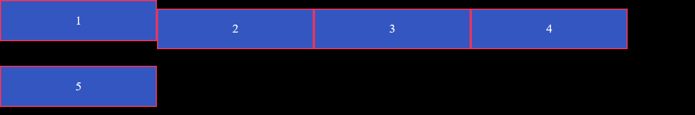

# Flex布局总结(二) #

## 目录 ##

1. 前言
2. 参考链接
3. 项目
    1. order属性
    2. flex-grow属性
    3. flex-shrink属性
    4. flex-basis属性
    5. flex 属性
    6. align-self属性

## 前言 ##

> 本篇是基于[Flex布局总结(一)](https://github.com/WeiJietao/LogBase/blob/master/Flex%E5%B8%83%E5%B1%80%E6%80%BB%E7%BB%93(%E4%B8%80).md)的续作，主要讲解 Flex 项目的相关知识。

## 参考链接 ##

- [Flex布局语法教程](http://www.ruanyifeng.com/blog/2015/07/flex-grammar.html?utm_source=tuicool&utm_medium=referral)

- [Flex布局总结(一)](https://github.com/WeiJietao/LogBase/blob/master/Flex%E5%B8%83%E5%B1%80%E6%80%BB%E7%BB%93(%E4%B8%80).md)

## 项目 ##

容器的所有子元素自动成为容器成员，称为 Flex 项目(Flex Item)。项目可以设置6个 CSS 属性：

- order
- flex-grow
- flex-shrink
- flex-basis
- flex
- align-self

### order属性 ###

order 属性定义项目的排列顺序，其取值为一个整数，数值越小，该项目就越靠前，默认值为0。

将 ul 标签的内容修改为：

```
<ul>
    <li style="order:4"> 1 </li>
    <li style="order:5;"> 2 </li>
    <li style="order:2;"> 3 </li>
    <li style="order:3;"> 4 </li>
    <li style="order:1;"> 5 </li>
</ul>
```

查看效果为：


### flex-grow属性 ###

flex-grow 属性定义项目的放大比例，默认值为0，表示不放大。

将 li 标签的 width 设置为0，然后将 ul 标签的内容修改为：
```
<ul>
    <li style="flex-grow:1;"> 1 </li>
    <li style="flex-grow:2;"> 2 </li>
    <li style="flex-grow:1;"> 3 </li>
    <li style="flex-grow:1;"> 4 </li>
    <li style="flex-grow:1;"> 5 </li>
</ul>
```

查看效果为：


### flex-shrink属性 ###

flex-shrink 属性定义了项目的缩小比例，不能取负值，默认值为1，取值为0表示不缩小。

如果所有项目的 flex-shrink 属性都设为1，当空间不足时，都将等比例缩小，如果一个项目的 flex-shrink 属性为0，其他项目都为1，则空间不足时，前者不缩小。

将 ul 标签的 width 改为 500，然后将 ul 标签的内容修改为：

```
<ul>
    <li style="flex-shrink:0;"> 1 </li>
    <li style="flex-shrink:1;"> 2 </li>
    <li style="flex-shrink:1;"> 3 </li>
    <li style="flex-shrink:1;"> 4 </li>
    <li style="flex-shrink:1;"> 5 </li>
</ul>
```

查看效果为：


### flex-basis属性 ###

flex-basis 属性定义了在分配多余空间之前，项目占据的水平轴空间，浏览器根据这个属性，计算水平轴是否有多余空间，默认值为`auto`，即项目的本来大小。

修改第一个 li 标签为`<li style="flex-basis:100px;"> 1 </li>`，查看效果为：


### flex属性 ###

flex 属性是 flex-grow、flex-shrink 和 flex-basis 属性的组合，默认值为`0 1 auto`，后两个属性可选。

flex 属性可以使用两个快捷值：`auto`和`none`，`auto`相当于`1 1 auto`，`none `相当于`0 0 auto`。

### align-self属性 ###

align-self 属性允许单个项目有与其他项目不一样的对齐方式，可覆盖 align-items 属性。默认值为`auto`，表示继承父元素的 align-items 属性，如果没有父元素，则等同于`stretch`。

该属性可取6个值，除了`auto`，其他值皆与 align-items 相同。

修改 ul 标签的 height 为150px，并将 flex-wrap 属性设为 `wrap`，将 align-items 属性设为 `center`，修改第一个 li 标签为`<li style="align-self:flex-start;"> 1 </li>`，查看效果为：



---

```
ARTICLE_ID : 49
POST_DATE : 2017/12/10
AUTHER : WJT20
```
