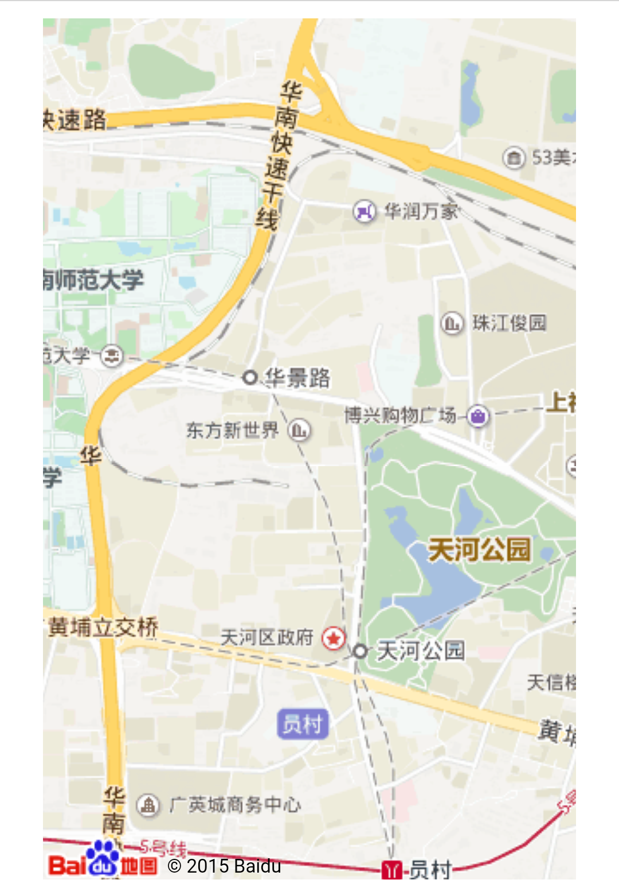

# 关于地理定位的笔记 #

## 目录 ##

1. 介绍
2. 获取坐标
3. 错误处理
4. 在地图中显示结果
5. 百度地图API

## 介绍 ##

HTML5 Geolocation API 用于获得用户的地理位置。获取位置涉及到用户隐私，所以需要用户允许获取位置。

## 获取坐标 ##

使用获取地理位置的 API 位于 navigator.geolocation 对象上，获取地理位置用到了 getCurrentPosition(callback, errHandle) 方法，该方法接收一个回调函数作为参数，该回调函数内部可以访问一个位置对象参数，这个位置对象参数包含当前地理位置信息；第二个可选参数为请求地理位置发生错误时执行的函数，这个函数内部可以访问一个错误对象参数。

注意，获取地理位置信息需要连接互联网。

```
if (navigator.geolocation) {
    navigator.geolocation.getCurrentPosition(function(position) {
        alert("经度：" + position.coords.longitude + "，纬度：" + position.coords.latitude);
    });
} else {
    alert("浏览器不支持获取地理位置");
}
```

## 错误处理 ##

前面提到 getCurrentPosition() 方法可以接受第二个参数，第二个参数是当获取地理位置出错时运行的错误处理函数。错误类型保存在错误对象的 code 属性上，通常获取地理位置信息会发生的错误有以下几种：

1. PERMISSION_DENIED：用户拒绝获取地理位置的请求；
2. POSITION_UNAVAILABLE：位置信息不可用；
3. TIMEOUT：请求地理位置超时；
4. UNKNOW_ERROR：未知错误。

```
if (navigator.geolocation) {
    navigator.geolocation.getCurrentPosition(function(position) {
        alert("经度：" + position.coords.longitude + "，纬度：" + position.coords.latitude);
    }, function(error) {
        switch(error.code) {
            case error.PERMISSION_DENIED:
                alert("用户拒绝获取地理位置的请求");
                break;
            case error.POSITION_UNAVAILABLE:
                alert("位置信息不可用");
                break;
            case error.TIMEOUT:
                alert("请求用户地理位置超时");
                break;
            case error.UNKNOW_ERROR:
                alert("未知错误");
                break;
        }
    });
} else {
    alert("浏览器不支持获取地理位置");
}
```

## 在地图中显示结果 ##

谷歌地图 API 可以根据地理位置坐标数据获取地图图片，调用谷歌地图 API 获取图片需要加载一段时间。

```
if (navigator.geolocation) {
    navigator.geolocation.getCurrentPosition(function(position) {
        var latlon = position.coords.latitude + "," + position.coords.longitude;
        var imgURL = "http://maps.googleapis.com/maps/api/staticmap?center=" + latlon + "&zoom=14&size=400x300&sensor=false";//传递坐标数据
        var img = document.createElement("img");
        img.setAttribute("src", imgURL);
        document.body.appendChild(img);//动态插入图片
    });
} else {
    alert("浏览器不支持获取地理位置");
}
```

## 百度地图API ##

在国内地图类应用中，百度地图算是其中比较杰出的一款地图应用，它对外提供了一套功能完备的SDK，详细的说明请参考官方文档: http://lbsyun.baidu.com/index.php?title=jspopular。

百度地图新版本 JS API 文件需要提供私钥:

```
<script src="http://api.map.baidu.com/api?v=2.0&ak=你的密钥"></script>
```

为方便演示，我引入旧版本的 JS API 文件:

```
<script src="http://api.map.baidu.com/api?v=1.2"></script>
```

使用百度地图API定位当前位置的代码如下:

```
<!DOCTYPE html>
<html>
<head>
    <!-- 省略 -->
    <script src="http://api.map.baidu.com/api?v=1.2"></script>
</head>
<body>
    <div id="map" style="width:90%;height:500px;margin:10px auto;"></div>
    <script>
    (function() {
        //创建地图实例
        var map = new BMap.Map('map');
        var latitude,longitude;

        if (navigator.geolocation) {
            navigator.geolocation.getCurrentPosition(function(position) {
                //创建一个坐标
                var point =new BMap.Point(position.coords.longitude, position.coords.latitude);
                //地图初始化，设置中心点坐标和地图级别
                map.centerAndZoom(point, 15);
            });
        } else {
            alert("浏览器不支持获取地理位置");
        }
    })();
    </script>
</body>
</html>
```

示例图:



```
ARTICLE_ID : 7
POST_DATE : 2017/08/13
AUTHER : WJT20
```
