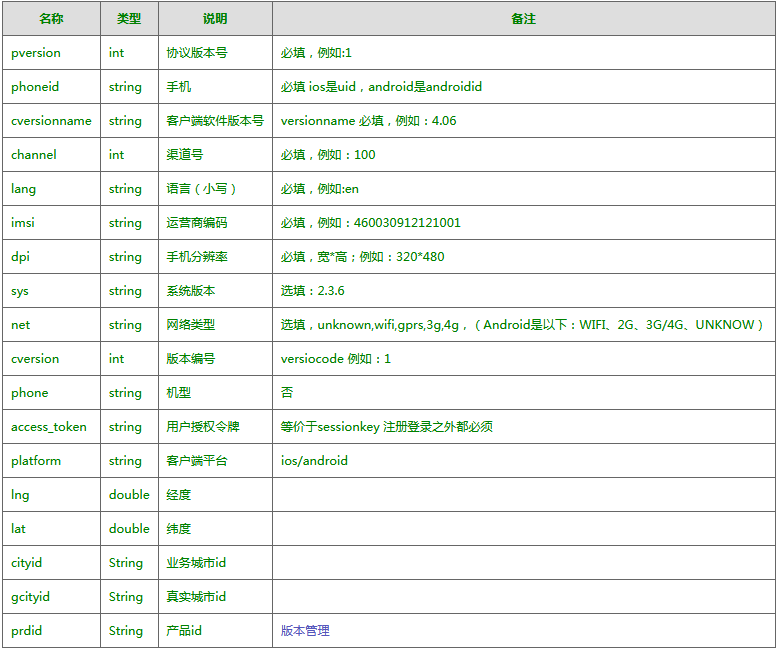
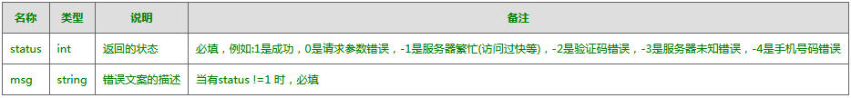

## SVN ##

### SVN 的几个操作说明 ###

1. Check out：检出，从服务器端取得代码

把服务器资料库里存放的某个项目代码取出来，放到本地主机中，这个动作叫做"check out"。使用具体步骤：进入要安装项目文件的目录中，点击鼠标右键，选择SVN Check out项，然后填写项目的原始路径和安装路径后点击"ok"即可。

2. Update：更新，更新项目代码

以前 checkout 过的一个项目代码，当服务器上有了更新的代码，或者本地代码损坏或丢失，update 可以自动判断本地哪些文件较旧，或者缺少，都会自动更新。当然，你也可以删除掉本地代码，重新check out。使用具体步骤为：在要更新的项目上点击鼠标右键，选择"SVN Update"项即可。

3. Commit：提交，将本地代码上传到服务器

当修改(增加，删除，修改等所有写操作)过本地代码后，这个动作会把新代码提交到 SVN。如果本地代码做了修改，不执行commit操作，SVN 服务器上是 不会有这个新版本的，也就是说其它人也得不到。对代码做过修改后，应尽快commit。使用具体步骤：在修改完待上传的项目上点击鼠标右键，选择 "SVN Commit"项即可。

4. share Project：共享工程，把一个非 SVN 的工程，上传到 SVN 中。

### SVN协议 ###

访问SVN资源库的协议通常有三种：

1. http：客户端和浏览器都可以访问。

2. https：客户端和浏览器都可以访问，同时比http更安全。

3. svn：只能通过客户端访问。

### 资源仓库 ###

SVN 资源仓库中有三个非常重要的目录，trunk(主干)、branches(分支)、tags(标签)，其作用是：

1. trunk：一般的项目都是基于主干开发的。

2. branches：分支，一般用于有某些开发功能时，需要基于主干开分支，开发完成后要合并到主干。

3. tags：标签，项目开发完成后，发布上线时，需要将主干的代码打标签到 tags 中，一般情况下，tags 的内容是只读的。

---

## 杂记[一] ##

- 跳转下载APP ##

    ```
    //下载
    $(document).delegate('.xmiles-download','click',function(event) {
        if (bIsAndroid) {
            // 特殊处理：呱呱财经 201705102108
            if (settings.channel == 10664) {
                window.location.href = 'guagua://guagua::2::3:' + encodeURIComponent('http://release.xmiles.cn/android/chezhuwuyou_2.97_svn73377_1034.apk') + ';10:1';
                return;
            }
        }

        if (bIsAndroid && !bIsWechat && !bIsHuawei) {
            if (settings.qiNiuDownload) {
                    //跳到7牛下载
                    window.location.href = 'http://release.xmiles.cn/android/yunying/' + channel + '/chezhuwuyou.apk';
            } else {
                    if(settings.channel == 10277) {
                        window.location.href = 'http://xmiles.cn/coupon/downapp?from='+settings.channel;
                        return;
                    }
                //跳到手机市场，这个要看第三方客户端是否支持
                window.open("market://details?id=com.starbaba.starbaba");
            };
        } else if(BIsIOS && !bIsWechat) {
            if(settings.channel != '' && settings.channel != null){
                window.location.href = 'https://itunes.apple.com/app/apple-store/id984033851?pt=117768206&ct=' + settings.channel + '&mt=8';
            }else{
                window.location.href = 'https://itunes.apple.com/app/apple-store/id984033851?pt=117768206&ct=1000&mt=8';
            }
        } else {
            window.location.href = 'http://xmiles.cn/coupon/downapp?from='+settings.channel;
        };
    });
    ```

- 下沿浮动窗

    HTML: 

    ```
    <div id="confirm_container">
        <div id="confirm_divider"></div>
        <span id="need_to_pay">
            实付款<span id="need_to_pay_money" class="height_light"></span>元
        </span>
        <span id="time_yugu">
            预计2~5个工作日办理完成
        </span>
        <div id="confirm_button">
            <span>立即支付</span>
        </div>
    </div>
    ```

    CSS:

    ```
    #confirm_container {
        width: 100%;
        height: 66px;
        position: fixed;
        left: 0;
        bottom: 0;
        background: white;
    }
    /* 上边沿线 */
    #confirm_divider {
        width: 100%;
        height: 3px;
        background: -webkit-linear-gradient(top, rgba(0, 0, 0, 0), rgba(0, 0, 0, 0.1));
    }
    #need_to_pay {
        padding-left: 15px;
        font-size: 15px;
        color: #313131;
        display: block;
        margin-top: 10px;
    }
    #need_to_pay_money {
        font-size: 19px;
    }
    #time_yugu {
        color: #909090;
        font-size: 14px;
        padding-left: 15px;
        display: block;
    }
    #confirm_button {
        width: 92px;
        height: 36px;
        color: white;
        background: #fd8b0a;
        border-radius: 3px;
        text-align: center;
        position: absolute;
        right: 14px;
        top: 14px;
    }
    #confirm_button span {
        font-size: 15px;
        line-height: 36px;
    }
    ```

- 切换开关

    HTML:

    ```
    <div id="on_off">
        <input id="checkbox_c1" class="chk_3" value="on" type="checkbox">
        <label for="checkbox_c1"></label>
    </div>
    ```

    CSS:

    ```
    #on_off {
        width: 25px;
        position: absolute;
        right: 15px;
        top: 16px;
    }
    .chk_3 {
        display: none;
    }
    .chk_3 {
        display: none;
    }
    .chk_3 + label {
        background-color: #c8c8c8;
        border-radius: 50px;
        display: inline-block;
        position: relative;
        margin-right: 30px;
        transition: all .1s ease-in;
        width: 24px;
        height: 14px;
    }
    ```

- 接口函数

    - platform_launch

        ```
        platform_launch({
            "launch": "launch_vc_webView",
            "launchParams": {
                "title": "4S店更多",
                "htmlUrl": "http://www.baidu.com",
                "withHead":1, //请求里面是否带上phead。默认值是1，需要带上phead。如果为0，就不带。
                "showToolbar":0,//是否显示toolbar。默认值是0，不需要显示。如果为1，就显示。
                "clearTop":0, //跳转后是否需要将原来顶级的界面销毁，默认是0，不需要销毁。
                "canBlockNetworkImg":1,  //界面是否可以限制网络图片加载，默认是1，可以限制。如果想该页面不受省流量模式限制，就传0。
                "reloadWhenLogin":0, //当用户登录后，是否需要重新加载页面，默认值是0，不需要重新加载。如果是1，就需要。
                "reloadWhenLogout":0, //当用户登出后，是否需要重新加载页面，默认值是0，不需要重新加载。如果是1，就需要。
                "takeOverBackPressed":0, //是否由html页面接管返回键的处理。默认值是0，不由页面接管。如果是1，由页面接管，页面要负责页面的关闭，页面回调接口javascript:onBackPressed()。
                "callbackWhenResumeAndPause":0, //客户端是否在resume和pause时回调页面接口javascript:onResume()和javascript:onPause()。默认值是0，不回调。如果是1，需要回调。
                "showTitle":1, //客户端是否显示标题栏。默认值为1，需要显示标题栏。如果为0，就由页面来显示标题栏。
                "injectCss":0, //客户端是否对加载的页面注入http://xmiles.cn/js_css/xmiles_inject.css。默认值是0，不注入。如果是1，就注入。
                "registerMessage":["order_effective","order_pay"],//页面要注册监听的消息。
                "backLaunchParams":{}//按返回键后的跳转参数，参考消息中心跳转协议参数。如果没有参数，就直接关闭页面。如果有参数，关闭页面，并进行跳转。
                "usePost":1, //是否用post打开url，1用post，0用get。默认0。
                "postData":{}, //usePost为1时附带的数据,逐个解析放到与phead同级传递到web
                "controlPageBack":1// 是否控制网页返回，1控制，0不控制。默认为1。
            }
        });
        ```

    - platform_reloadAll

        platform_reloadAll 用于重载页面。

    - platform_gotoLogin

        platform_gotoLogin 用于跳转到登录页面。

- 低版本接口兼容函数

    ```
    function setCompatible(funcString, callbackString, wrongFunc) {
        try {
            var params = Array.prototype.slice.call(arguments, 3);
            eval(funcString + "('javascript:" + callbackString + "(" + params.join(",") + ")')");
        } catch(e) {
            if (wrongFunc) {
                wrongFunc();
            }
            console.log("previous version");
        }
    } //兼容低版本客户端接口包装
    ```

- 协议规范

    - phead

        

    - 响应数据头

        

- head规范

    ```
    <head>
        <title>...</title>
        <link rel="shortcut icon" href="http://xmiles.cn/favicon.ico" type="image/x-icon" />//浏览器标题栏图标,已上传到正式服务器(不放七牛).图标迟尺寸:48x48,如需其他尺寸请自行修改
        <meta http-equiv="Content-Type" content="text/html; charset=utf-8">//声明文档编码
        <meta name="viewport" content="width=device-width,initial-scale=1.0, minimum-scale=1.0, maximum-scale=1.0, user-scalable=no"/>//优化移动浏览器的显示,宽等于设备宽度,例如:nexus5的宽为360px,initial-scale：初始的缩放比例 （范围从>0 到10）minimum-scale：允许用户缩放到的最小比例maximum-scale：允许用户缩放到的最大比例user-scalable：用户是否可以手动缩 (no,yes)
        <meta name="apple-mobile-web-app-capable" content="yes">//删除默认的苹果工具栏和菜单栏<
        <meta name="apple-mobile-web-app-status-bar-style" content="black-translucent">//控制IOS状态栏显示样式
        <meta name="format-detection" content="telephone=no">//format-detection声明格式检查,telephone=no就禁止了把数字转化为拨号链接
        <meta name="format-detection" content="email=no"/>//禁止识别邮箱
        <meta http-equiv="Cache-Control" content="no-siteapp" />//避免用百度打开网页可能会对其进行转码（比如贴广告）
    </head>
    ```

- CSS reset

    借鉴：[http://xmiles.cn/js_css/xmiles_reset.css](http://xmiles.cn/js_css/xmiles_reset.css)

- package.json 的 devDependencies 和 dependencies

    devDependencies下列出的模块，是我们开发时用的，比如第三方压缩插件，我们用它混淆js文件，它们不会被部署到生产环境。dependencies下的模块，则是我们生产环境中需要的依赖

- webpack plugin

    1. webpack 内置的 DefinePlugin：根据编辑环境去设置是否开启 debug；
    2. webpack-md5-hash：当设置提取样式文件的时候，css/js 的修改都会影响到彼此的的 hash 值，使用这个插件可以有效避免这种情况，有利于缓存；
    3. assets-and-replace-webpack-plugin：支持读写 jsp/html 文件(写入原 chunsname.js 中的带最新 chunkhash 的js文件 -- chunksname.js 仍然保留,用于对比)，插件已对外发布到 npmjs；
    4. clean-webpack-plugin：每一次打包，webpack默认都不会操作旧文件，用这个插件可以实现清理文件夹的功能，不至于文件过多；
    5. webpack.optimize.UglifyJsPlugin：使用 UglifyJs 协议压缩；
    6. webpack.optimize.OccurenceOrderPlugin：按引用频度来排序 ID，以便达到减少文件大小的效果；
    7. extract-text-webpack-plugin：是否提取(样式)文件。

- 浏览器判断规则

    ```
    var sUserAgent = navigator.userAgent.toLowerCase();
    var browser = {
        bIsIOS: !!navigator.userAgent.match(/\(i[^;]+;( U;)? CPU.+Mac OS X/),
        bIsUc: sUserAgent.match(/ucweb/i) == "ucweb",
        bIsAndroid: sUserAgent.match(/android/i) == "android",
        bIsAndroidVersion: Number(sUserAgent.substr(sUserAgent.indexOf('android') + 8, 3)),
        bIsQQ: sUserAgent.match(/qq/i) == "qq",
        bIsWechat: sUserAgent.match(/micromessenger/i) == "micromessenger",
        bIsWeibo: sUserAgent.match(/weibo/i) == "weibo",
        bIsHuawei: sUserAgent.match(/huawei/i) == "huawei"
    };
    ```

- 异步加载js的公共方法

    ```
    function initResource(scriptUrl, callbackString){
    $.ajax({
        type: "GET",
        timeout: 3000000,
        url: scriptUrl,
        dataType: "script",
        cache: true,
        ifModified: true,
        success: function(){
        eval(callbackString);
        }
    });
    };
    ```

- 异步加载css的公共方法

    ```
    function initCssResource(cssUrl){
    $("head").append("<link>");
    css = $("head").children(":last");
    css.attr({
        rel: "stylesheet",
        type: "text/css",
        href: cssUrl
    });
    };
    ```

- 创建link，并且加到head最后

    ```
    function creatAndChangeLink(cssUrl){
        var cssPath = '/fanli_service/pages/css/',
            cssUrl = cssPath + cssUrl + '?v=' + new Date().getTime(),
        linkTag = $('<link rel="stylesheet" href="' + cssUrl + '"/>');
        $($('head')[0]).append(linkTag);
    }
    ```

- 图片惰性加载

    ```
    function formatAndLazy(targer) {
        $(targer).each(function() {
            var $src = $(this).attr('data-original');
            if (!isNull($src)) {
                if (browser.bIsAndroid && browser.bIsAndroidVersion > 4.1 && !browser.bIsHuawei) {
                    $src += '?imageView2/0/format/webp';
                } else {
                    if ($src.indexOf('jpg') > -1 || $src.indexOf('jpeg') > -1) {
                        $src += '?imageView2/0/format/jpg';
                    } else {
                        $src += '?imageView2/0/format/png';
                    }
                };
                $(this).attr({
                    'data-original': $src
                });
            }
        }).lazyload({
            threshold: 200
        });
    };
    ```

- 判断是否为空的方法

    ```
    function isNull(data) {
        //解决处理判断数字0=''的问题
        if (data == 0) {
            data = data.toString();
        }
        return data == null || data == '' || data == 'undefined' || data.length == 0;
    };
    ```

- 阻止屏幕滚动的方法

    ```
    function listener(ban) {
    if (ban == 0) {
        $('body').bind('touchmove', function(event) {
        return false;
        });

        $('body').bind('scroll', function(event) {
        return false;
        });

        $('body').bind('mousewheel', function(event) {
        return false;
        });

    } else {
        $('body').unbind('touchmove').bind('touchmove');
        $('body').unbind('scroll').bind('scroll');
        $('body').unbind('mousewheel').bind('mousewheel');
    };
    };
    ```

- 获取基本的POST数据

    ```
    function getBasePostData(phead) {
        phead = phead || window.phead;
        var _pheadsource = JSON.stringify(phead);
        _pheadsource = '{"phead":' + _pheadsource + ', "ispage": 1}';
        _pheadsource = '{"data":' + _pheadsource + ', "shandle": 0, "handle": 0}';
        return _pheadsource
    }
    ```

- 检查手机号码格式

    ```
    function checkPhoneFormat(phone) {
        var pattern = /^0?1[3|4|5|7|8][0-9]\d{8}$/;
        if (pattern.test(phone)) {
            return true;
        } else {
            return false;
        }
    };
    ```

- 获取链接尾部参数

    ```
    function GetRequest() {
        var url = location.search;
        var theRequest = new Object();
        if (url.indexOf("?") != -1) {
            var str = url.substr(1); //获取url中"?"符后的字串
            return str.replace(/amp;/g, "&"); 
        } else {
            return str;
        }
    }
    ```

---

## frontend_service ##

```
- frontend_service/
    - app/
        - cfg/
            - config.js：数据库账号密码信息
            - const.js：配置常量
            - dbpool.js：数据池？
            - path.js：项目根目录路径(/)和模板路径(views)
        - controllers/
            - address/request_combine.js：以坐标获取位置的方法RequestCombine
            - db/db_monitor.js：数据库监视器
            - interface/
                - czwy/
                - fanli/
    - views/
        - cfg/
            - location.js：页面配置2
```

D:\WJT\self\frontend_service\app\controllers\interface\czwy\static_pages.js
D:\WJT\self\frontend_service\views\cfg\location.js
D:\WJT\self\frontend_service\views\location.js

本地启动服务，访问链接为：http://127.0.0.1:3000/frontend_service/common?appid=x&funid=xxxx
根据appid访问不同的服务：1为车主无忧；2为财迷之家

根据funid访问各自配置的页面，页面的配置在：
1. 车主无忧 —— \app\controllers\interface\czwy\static_pages.js
2. 财迷之家 —— \app\controllers\interface\fanli\static_pages.js

列举配置页面的选项：
1. funid：访问的关键
2. apiInfo.title：页面标题
3. apiInfo.useReact：是否使用react，默认为false

webpack在\views\cfg\location.js中entry和pages项中配置

index.jsx页面一般不需要改动。所要加载的JS代码和CSS代码统一从entry/entry.js引入，打包生成的目标文件名在views/cfg/location.js中配置。编写的组件在components/app.jsx中引入，常用的通用组件有Toast和Loading等。
1. toast的使用：storeActions.toast.dispatch(text)；
2. loading的使用：storeActions.loading.dispatch(num)，num为1显示loading，为0隐藏loading。

app.jsx中将静态数据写入storeStatics(一个可以在组件间流通的全局变量)中，诸如phead、browser和env等值都是要存入其中的。

componentDidMount是页面加载完成后所要执行的代码。
componentWillReceiveProps是当组件传入的props发生变化时调用的代码。

请求数据使用引入的requestData方法，必需的配置项有：
1. funid(接口号)
2. service(访问服务)
3. appid(服务类型，1或2)
4. callback(执行完毕触发回调)

事件编写类似于：<div onClick={() => { this.hide() }}>，React组件是一个状态机，触发事件实际上是修改某个状态(state，通过this.setState(obj))值来达到我们要实现的目的。

在JSX中，使用一些特殊的HTML属性例如class、for等都是违法的，class应替换className，for应替换htmlFor。

编写一个组件需要引入什么？视情况而定，注意依赖关系，例如，若需要使用store，则要引入storeStatics；需要使用toast、loading等则要引入storeActions；若需要请求数据，则要引入requestData。

高度递降柱形动画并映射数值完成。

图片懒加载：引入 Lazyload 插件，将要实现懒加载的图片包裹在 Lazyload 标签中，例如：

```
<Lazyload offset={200} height={40}>
    
</Lazyload>
```

--

## campaign_service ##

图片懒加载使用：
1) JS：
```
//懒加载功能
formatAndLazy(".lazy");
```

2) HTML：
```

```

请求数据：
```
//请求地址
let thisRequestUrl = `${GLOBAL_URL + GLOBAL_SERVICE}common?funid=33&rd=${new Date().getTime()}`;
let pheadsource = getBasePostData(phead);
$.ajax({
    type: "post",
    timeout: 600000,
    url: thisRequestUrl,
    data: pheadsource,
    dataType: "json",
    contentType: "application/json",
    beforeSend: function () {
        __DEBUG__ && console.log(thisRequestUrl, pheadsource);
    },
    success: function (data) {
        __DEBUG__ && console.log(data); 
        initList(data);
    },
    error: function(xhr, status, errorThrown){
        console.log(xhr, status, errorThrown);
        toast('网络错误,请重试');
    }
});
```

---

```
ARTICLE_ID : 19
POST_DATE : 2017/08/21
RECENTLY_MODIFY : 2017/08/30
TIME_COUNTER : 10
AUTHER : WJT20
```
