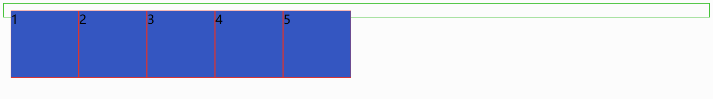
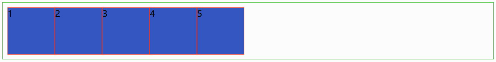

# 元素浮动原理 #

## 目录 ##

1. 参考链接
2. 基本概念
3. 浮动规律
4. 高度坍塌
5. 清除浮动
    1. 使用带clear属性的空元素
    2. 使用CSS的overflow属性
    3. 给浮动的元素的容器添加浮动
    4. 使用CSS的:after伪元素

## 参考链接 ##

- [关于浮动与清除浮动，你应该知道的](https://segmentfault.com/a/1190000005859252)

- [CSS-清除浮动](https://segmentfault.com/a/1190000004865198)

## 基本概念 ##

块级(block)元素：总是独占一行，表现为另起一行开始，而且其后的元素也必须另起一行显示。宽度(width)、高度(height)、内边距(padding)和外边距(margin)都可控制。块级元素主要有：address、blockquote、center、dir、div、dl、fieldset、form、h1、h2、h3、h4、h5、h6、hr、isindex、menu、noframes、noscript、ol、p、pre、table、ul、li 等。

内联(inline)元素：和相邻的内联元素在同一行，宽度(width)、高度(height)、内边距的  top/bottom(padding-top/padding-bottom) 和外边距的 top/bottom(margin-top/margin-bottom) 都不可改变，就是里面文字或图片的大小。内联元素主要有：a、abbr、acronym、b、bdo、big、br、cite、code、dfn、em、font、i、img、input、kbd、label、q、s、samp、select、small、span、strike、strong、sub、sup、textarea、t、u、var 等。

浮动：设置浮动的元素会脱离文档流，不会影响块元素的布局，但是会影响内联元素的排列(通常是文本)。

文档流：在文档流中，块元素会单个元素独占一行。

## 浮动规律 ##

如果浮动元素的上一个元素也是浮动，那么该元素会与上一个元素排列在同一行，如果行宽不够，后面的元素会被挤到下一行；

如果浮动元素的上一个元素不是浮动，那么该元素仍然处于上一个元素的下方，根据浮动设定在左或者在右，而其本身也脱离文档流。后边的元素会自动往上移动到上一个文档流块元素下方为止。

## 高度坍塌 ##

当没有指定高度的父元素中的子元素全部都浮动时，父元素中内部高度因为是普通流中的块元素撑起来的，所以这个时候父元素的高度会变成0，或者会有部分浮动元素的位置会超出父元素的高度之外。这种现象，叫做高度坍塌。

先看下以下代码：

HTML 结构：

```
...
<ul className="float-list">
    <li className="item">1</li>
    <li className="item">2</li>
    <li className="item">3</li>
    <li className="item">4</li>
    <li className="item">5</li>
</ul>
...
```

CSS 代码：

```
...
.float-list{
    padding: 10px;
    border: 1px solid #41c134;
    list-style: none;
}
.float-list .item{
    width: 100px;
    height: 100px;
    background-color: #3456c1;
    float: left;
    border: 1px solid #e93124;
}
...
```

以上 CSS 代码中，每个列表项元素都设置了`float:left`，且列表元素没有设置具体高度值，所以就出现了"高度坍塌"，效果图如下：



## 清除浮动 ##

简单来说，清除浮动的直接目的就是解决前面所说到的高度坍塌问题。清除浮动的方式主要有以下这些。

### 使用带clear属性的空元素 ###

在浮动元素后使用一个空元素如`<div class="clear"></div>`，并在 CSS 中赋予`.clear{clear:both;}`属性即可清理浮动。亦可使用`<br class="clear" />`或`<hr class="clear" />`来进行清理。

优点：简单，代码少，浏览器兼容性好。
缺点：需要添加大量无语义的html元素，代码不够优雅，后期不容易维护。

使用这种方法，HTML 部分代码变为这样：

```
...
<ul className="float-list">
    <li className="item">1</li>
    <li className="item">2</li>
    <li className="item">3</li>
    <li className="item">4</li>
    <li className="item">5</li><br class="clear" />
</ul>
...
```

CSS 代码：

```
...
.clear{
    clear: both;
}
...
```

效果图如下(后面讲述的其他清除浮动效果图都是一样的，故之后不会给出)：



### 使用CSS的overflow属性 ###

给浮动元素的容器添加`overflow:hidden;`或`overflow:auto;`可以清除浮动，另外在 IE6 中还需要触发 hasLayout ，例如为父元素设置容器宽高或设置`zoom:1`。在添加 overflow 属性后，浮动元素又回到了容器层，把容器高度撑起，达到了清理浮动的效果。

这种方法比第一种方法稍微好用点，不需要改动到 HTML 结构，只需要给容器元素添加 CSS 属性，代码如下：

```
...
.float-list{
    padding: 10px;
    border: 1px solid #41c134;
    list-style: none;
    overflow: hidden;
    *zoom: 1;
}
...
```

### 给浮动的元素的容器添加浮动 ###

给浮动元素的容器也添加上浮动属性即可清除内部浮动，但是这样会使其整体浮动，影响布局，不推荐使用。

### 使用CSS的:after伪元素 ###

结合 :after 伪元素和 IEhack ，可以完美兼容当前主流的各大浏览器，这里的 IEhack 指的是触发 hasLayout。
给浮动元素的容器添加一个 clearfix 的 class，然后给这个 class 添加一个 :after 伪元素实现元素末尾添加一个看不见的块元素清理浮动。这种是最推荐的清除浮动用法。

同样只需要修改 CSS 的内容：

```
...
.float-list:after{
    content: "020";
    display: block;
    height: 0;
    clear: both;
    visibility: hidden;
}
...
```

---

```
ARTICLE_ID : 51
POST_DATE : 2017/12/16
AUTHER : WJT20
```
